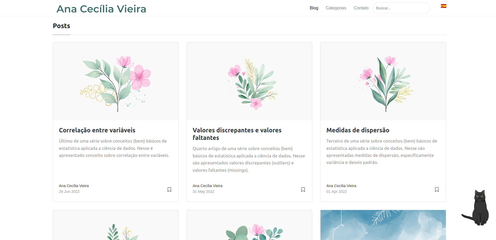

# Mediumish - Jekyll Theme Customizado

[Live Demo do tema original](https://wowthemesnet.github.io/mediumish-theme-jekyll/) | [Repositório do tema original](https://github.com/wowthemesnet/mediumish-theme-jekyll/) | [Documentação original do tema](https://bootstrapstarter.com/template-mediumish-bootstrap-jekyll/) | [Artigo sobre internacionalização do tema](https://cecivieira.com/criando-site-multilingue-com-jekyll/) | [Documentação do widget de gata](https://github.com/xiazeyu/live2d-widget.js) | [Pague um café ao criador(a) do tema](https://www.wowthemes.net/donate/)

Esse é o repositório do meu site, onde reúno artigos e tutoriais sobre o que vou aprendendo no meio do caminho. O tema original é o [Mediumish](https://github.com/wowthemesnet/mediumish-theme-jekyll/), no entanto realizei customização para [internacionalizar o tema](https://cecivieira.com/criando-site-multilingue-com-jekyll/) e inserir um [widget fofíssimo de uma gatinha](https://github.com/xiazeyu/live2d-widget.js).




## Requisitos

- [Ruby 2.7.8](https://www.ruby-lang.org/en/)
- Bundler 2.4.22
- Rake 13.0.6

> Se você é usuária do Ubuntu 22, sugiro que a instalação siga os passos 1, 2 e 3 [desse tutorial da DigitalOcean](https://www.digitalocean.com/community/tutorials/how-to-install-ruby-on-rails-with-rbenv-on-ubuntu-22-04). Mas, presta atenção que a versão que deve ser instalada é a 2.7.8.

> Se você é usuária de Mac OS, sugiro que a instalação siga as instruções da versão do Ruby usando o [rbenv](https://github.com/rbenv/rbenv.git)


## Instalação

1. Clone o repositório
```bash
git clone git@github.com:cecivieira/cecivieira.github.io.git
```

2. Instale o gerenciador de gems [Bundler](https://bundler.io/)
```bash
gem install bundler -v 2.4.22
```

3. Instale o gerenciador de tarefas [Rake](https://ruby.github.io/rake/)
```bash
gem install rake -v 13.0.6
```

4. Instale as dependencias do projeto
```bash
cd [caminho para a pasta do projeto]
bundler install
```


## Rodando no ambiente local

Para visualizar o site no seu ambiente local (computador), execute o servidor com o seguinte comando:

```bash
bundler exec jekyll serve --watch
```

Acesse o `Server address`, presente no output do comando anterior, para visualizar o site.


## Publicando o site

Com a customização para internacionalização do tema, foi desenvolvido o script presente no [Rakefile](Rakefile), o qual atualiza a rama `gh-pages`. Então, para publicar o site, execute o seguinte comando:

```bash
rake publish
```


### Licenças

[Sal](https://www.wowthemes.net) @ MIT license

[Live2d-widget.js](https://github.com/xiazeyu/live2d-widget.js) @ GNU Affero General Public License
