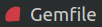
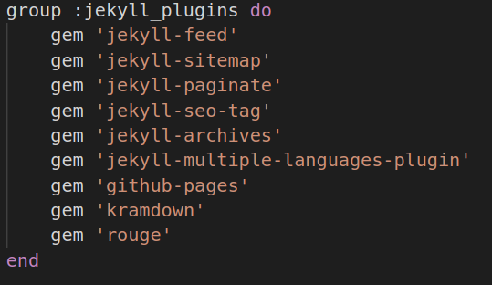
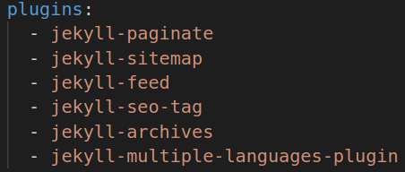
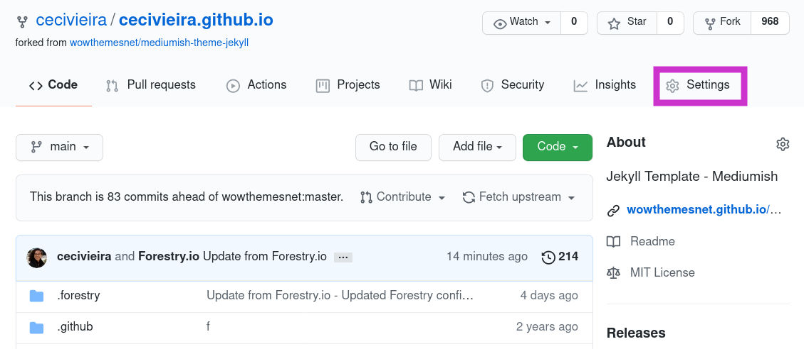
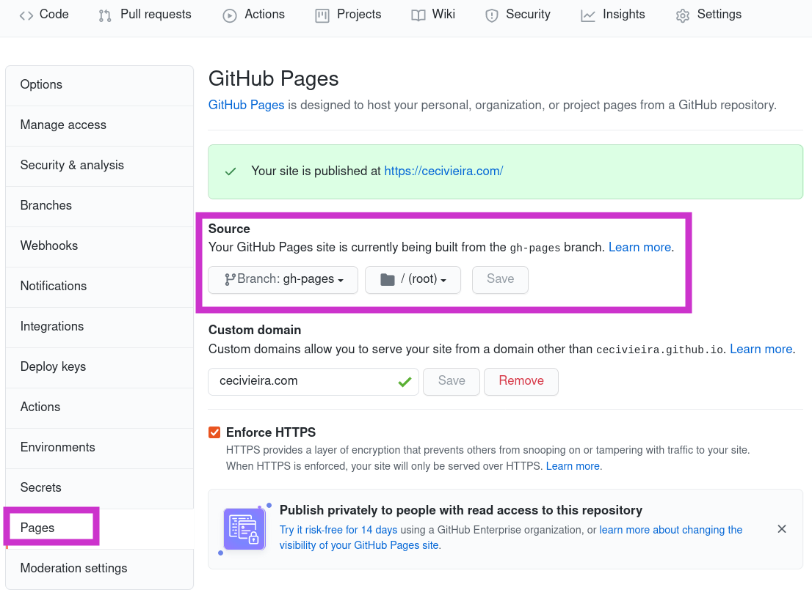

Pensando em ter um espaço para reunir minhas andanças nas comunidades de TI e artigos sobre o que estou estudando, criei este site. Você pode ler sobre a escolha e customização do tema [nesse post](/meu-site-customizando-o-tema-mediumish) [em construção].

Essas andanças começaram, com maior frequência, lá em 2019 na Espanha. Então eu precisava de um site que fosse, pelo menos, em português e castelhano/espanhol. Achei que isso seria fácil, escolhi o tema, customizei e fui pesquisar como fazer isso usando Jekyll... ban... descobri que precisava de um plugin e de uma gambiarra para que o GitHub Page entendesse a internacionalização. Isso me levou 1 semana de pesquisa e bastante horas de vida.

Abaixo deixo um tutorial para implementar a internacionalização em sites estáticos desenvolvidos em Jekyll e publicados no GitHub Page. 

> Esse tutorial pressupõe que você já encontrou o tema para seu site, clonou o repositório e fez os ajustes desejados. Se tu ainda não fez isso, corre [nesse artigo maravilhoso que Jéssica Temporal escreveu](https://jtemporal.com/do-tema-ao-ar/).

# Ferramentas

* [Jekyll Multiple Languages Plugin](https://github.com/kurtsson/jekyll-multiple-languages-plugin)
* [Rake](https://github.com/ruby/rake)
* [GitHub](https://github.com/)

# Tutorial

## 1. Jekyll Multiple Languages Plugin

O plugin Jekyll Multiple Languages vai permitir customizar o tema que você está usando para implementar multiplos idiomas. Para ler a documentação completa acesse o [repositório do plugin](https://github.com/kurtsson/jekyll-multiple-languages-plugin).

### Instalação

- Abra o arquivo Gemfile localizado na pasta raiz do seu site;
    

- Dentro dele haverá o grupo `:jekyll_plugins`. Dentro dele insira a linha `gem 'jekyll-multiple-languages-plugin'`. O código deverá parecer com isso:
   
    

2. No terminal, rode o comando abaixo para instalar esse novo plugin:
  ```bash
  bundle install
  ```

4. Agora, ative o plugin no seu projeto. Para isso, encontre o arquivo `_config.yml` na pasta raiz do seu site e adicione na lista de plugins:
  
  ```
  - jekyll-multiple-languages-plugin` 
  ```

  O código deverá parecer com isso:
   
  

Plugin instalado e ativado!

### Customização do tema

O plugin vai permitir que todo o site mude de idioma, de acordo com a seleção feita por quem está navegando na página. Para isso, vamos precisar fazer as seguintes customizações no código do nosso tema:

- Abra o arquivo `_config.yml` e insira a lista com todos os idiomas desejados. O primeiro idioma será usado como o padrão para seu site.

  ```   
  languages: ["pt-br", "es", "en"]
  ```

- Crie a pasta `_i18n` e dentro dela crie uma pasta para cada idioma da lista do passo anterior (exatamente com a mesma sigla).
  Nessa pasta colocaremos os posts e páginas referentes a cada idioma, então caso você já tenha posts, crie uma pasta `_post` na língua correspondente e mova-os. A estrutura da pasta deve aparecer assim:
  
  ```
  meusite/
  ├ _i18n/
    ├ pt-br/
      └ _posts/
    ├ es/
    └ en/
  ```

- Agora vamos criar arquivos de dados para cada um dos nossos idiomas. Isso vai facilitar as traduções das páginas html. Para isso, dentro da pasta `_i18n` crie um `yml` para cada lingua (exatamente com a mesma sigla da lista de idiomas do passo 1). A estrutura da pasta deve aparecer assim:

  ```
  meusite/
  ├ _i18n/
    ├ pt-br/
      └ _posts/
    ├ es/
    ├ en/
    ├ pt-br.yml   
    ├ es.yml
    └ en.yml
  ```

- Configure os arquivos de dados (yml) com informações básicas do site (name, description, keywords, lang) e com as variáveis que você for utilizar nas páginas html, por exemplo: títulos, subtítulos e links do menu (nav).

  É comum nos temas Jekyll que os arquivos das pastas `_includes` e `_layouts` sejam utilizados para criação das páginas estáticas, então, sugiro que você analize esses htmls e identifique os textos que você precisará traduzir. Nesse momento não vamos traduzir o conteúdo das páginas, apenas a sua estrutura.

  Os arquivos `yml` deverão aparecer assim:

  ```
  site:
    name: Ana Cecília Vieira
    description: 'Blog pessoal para compartilhar aprendizados e reunir minhas andanças pelas comunidades de tecnologia.'
    keywords: Tecnologia
    lang: pt-br
  main:
    home:
      topics: Temas
    categories:
      tags: Tipo de conteúdo
      topics: Tema
  pages:
    about: Sobre mim
    category: Categorias
    contact: Contato
    blog: Blog
  links:
    about: sobre-mim
    category: categorias
    contact: contato
    blog:
  ```

  **Lembre-se:** As variáveis obrigatórias são apenas as instanciadas nas 5 primeiras linhas do exemplo acima. As demais, foram criadas de forma arbitrária por mim para customização do tema que estou usando.

- Ao aplicar uma variável, o navegador vai entender magicamente qual palavra corresponde ao idioma selecionado pela pessoa que está navegando no seu site.

  Para aplicar uma variável usa-se a sintaxe `` . Exemplo:
  ```
  
  ```

  Essa chamada corresponde a variável da linha 10 do item anterior.

- Em Jekyll, os conteúdos das páginas estão em arquivos do tipo Markdown (`md`) . Para traduzí-los, você precisará criar arquivos específicos dentro da pasta de cada idioma. Por exemplo:

  ```
  meusite/
  ├ _i18n/
    ├ pt-br/
    ├ _posts/
      └ about.md
    ├ es/
    ├ _posts/
      └ about.md
    ├ en/
    ├ _posts/
      └ about.md
  ```

  Para chamar esses arquivos dentro de outro, usamos a sintaxe ``. Desse jeito o navegador vai entender qual conteúdo corresponde ao idioma selecionado pela pessoa que está navegando no seu site.

- As páginas do seu site estão dentro da pasta `_pages` , mas em alguns temas Jekyll (como o que estou usando) alguns arquivos da pasta `_layouts` também são usamos como página.

  Verifique o Front Matter de cada arquivo e identifique os que possuem a variável `permalink`, ela significa o link permanente daquela página no idioma original. Você deve incluir `permalink_<sigla da lista do passo 1>` para cada idioma, ele deve estar escrito obrigatoriamente com essa sintaxe. Além disso, deve incluir um `namespace` para aquela página, que será seu identificador único.

  O código deve parecer com esse:

  

  A URL dessas páginas ficarão assim em cada idioma:
  ```
  pt-br: <seu_dominio>/sobre-mim/
  es: <seu_dominio>/es/sobre-mi/
  en: <seu_dominio>/en/about/
  ```

- Com todo o nosso conteúdo e estrutura do site traduzidas, vamos acrescentar no nosso menu (navbar) a opção da língua para navegação.

  Para isso, usaremos o _Liquid_ filtro e variáveis do Jekyll ([documentação completa](https://jekyllrb.com/docs/liquid/)) aplicando esse trecho de código dentro do nosso navbar:

  ```ruby
  
    <li><a href="{{site.url}}"> 🇧🇷 </a></li>
    <li><a href="{{site.url}}{{site.baseurl}}/en"> 🇬🇧 </a></li>
  
    <li><a href="{{site.url}}"> 🇧🇷 </a></li>
    <li><a href="{{site.url}}{{site.baseurl}}/es"> 🇪🇸 </a></li> 
  { % else % }                
    <li><a href="{{site.url}}{{site.baseurl}}/es"> 🇪🇸 </a></li>
    <li><a href="{{site.url}}{{site.baseurl}}/en"> 🇬🇧 </a></li>
  
  ```

  Você pode encontrar outras maneiras de adicionar as bandeirinhas dos idiomas no seu menu ou até não usá-las. O importante desse trecho de código é você filtrar o conteúdo apresentado na página pelo idioma.

_Voilà!_ Temos um site multilíngue!! Reexecuta teu servidor local pra ver a mágica acontecer.

1. \[Opcional\] Em alguns temas Jekyll você vai precisar criar um index.html para cada idioma, o `/index.html` que encontra-se na pasta raiz do site para `/base.html` e adicionar o script abaixo:

  ```
  <script>
      var lang = navigator.language || navigator.userLanguage;
      if (lang.indexOf('es') == 0)
          window.location = '/es/';
      else if (lang.indexOf('en') == 0)
      window.location = '/en/';
      else
          window.location = '/pt-br/';
  </script>
  ```

  Não precisei fazer isso no tema que estou usando.

> Se você for hospedar seu site em um servidor compartilhado, é bem provável que você não precise seguir os próximos passos.
>
> Caso você faça deploy no Netlify ou GitHub Pages, segue lendo esse tutorial.

## 2. Rake

Apesar de nosso site funcionar lindamente em todos os idiomas no ambiente local, quando subimos para o GitHub Pages ele não funciona porque essa plataforma não entende o pluging Jekyll Multiple Languages. Então, como boa brasileira que somos, vamos fazer uma pequena gambiarra.

Para isso, usaremos o Rakefile, o makefile do Ruby. Rake, é um gerenciador de tarefas e dependências cujas as especificações são escritas em Ruby. Para saber mais detalhes [acesse sua documentação](https://github.com/ruby/rake).

Vamos usá-lo para gerar o site estático em multiplos idiomas e subir em uma nova brach do nosso repositório. 

### Instalação

1. Abra o arquivo Gemfile localizado na pasta raiz do seu site;

  

2. Na última linha, adicione o seguinte trecho de código para criar um novo grupo:

  ```ruby
  group :development do
      gem 'rake'
  end
  ```

3. No terminal, execute o código `gem install rake` .

### Script

1. Na pasta raiz do seu site, crie um novo arquivo com o nome `Rakefile` ;
2. Dentro dele coloque o seguinte script:

  ```ruby
  require "rubygems"
  require "tmpdir"
  require "bundler/setup"
  require "jekyll"

  # Indique o nome do seu repositório
  GITHUB_REPONAME = "<USUÁRIA/NOME DO SEU REPOSITÓRIO"

  desc "Geração de site estático"
  task :generate do
    Jekyll::Site.new(Jekyll.configuration({
      "source"      => ".",
      "destination" => "_site"
    })).process
  end

  desc "Geração de site estático e publicação no GitHub"
  task :publish => [:generate] do
    Dir.mktmpdir do |tmp|
      cp_r "_site/.", tmp

      pwd = Dir.pwd
      Dir.chdir tmp
      File.open(".nojekyll", "wb") { |f| f.puts("Site gerado localmente.") }

      system "git init"  
      system "git add ."
      message = "Site atualizado em #{Time.now.utc}"
      system "git commit -m #{message.inspect}"
      system "git remote add origin git@github.com:#{GITHUB_REPONAME}.git"
      system "git checkout -b gh-pages"
      system "git push origin gh-pages --force"

      Dir.chdir pwd
    end
  end
  ```

3. Rode o script usando o código `rake publish` . 

  Ele criará a branch "gh-pages" (caso ela ainda não exista), commitará o site estático multilíngue nela e fará push para o repositório remoto.

## 3. GitHub

O GitHub disponibiliza uma hospedagem grátis de um site estático diretamente do nosso repositório. Para mais detalhes [acesse o site do serviço](https://pages.github.com/).

Estou supondo que seu site em português já está no ar, caso contrário, corre [nesse artigo maravilhoso que Jéssica Temporal escreveu](https://jtemporal.com/do-tema-ao-ar/).

Para que seu site multilíngue entre no ar, teremos que identificar a branch criada no passo anterior, "gh-pages":

1. No menu do repositório, seleciona "Settings";
  

2. No meu lateral direito, selecione "Pages" para mostrar as configurações relativas ao GitHub Pages. Em seguida, localize o menu "Source" e selecione a branch que será usada para subir seu site, ou seja, "gh-pages".
  

Pronto!!! Seu site multilíngue , finalmente, está no ar!!!!

# Mantendo o site atualizado

Sempre que você fizer alterações no código do seu site ou se você usa o [Forestry](https://app.forestry.io/) para escrever e publicar seus posts, será necessário executar no terminal a seguinte sequência de código a cada nova modificação ou post escrito:

- [Passo obrigatório para quem usa Forestry.io] Atualize seu repositório local.
   ```
   git pull
   ```

- Atualize site:
  ```
  rake publish
  ```

Lembre-se, a branch "gh-pages" é só a conversão do código fonte do seu site para uma página legível pelo GitHub Pages, então nunca se esqueça de versionar o seu código fonte na branch "main".

---
# Referências
[A Guide to applying multilingual feature to github pages ](https://jerry901.github.io/en/2020/02/2020-02-06-01/)

[Rakefile to publish Jekyll to a User Page ](https://gist.github.com/ace-subido/51e1f12cd29fd94363f0)

[Script para build e deploy usando Rakefile](https://gist.github.com/DirtyF/24cb9c96b64173ecd85578f38bcc940d)

[Setting up a Proper Multilingual Site with GitHub Pages and Jekyll](https://www.klaasnotfound.com/2017/02/16/proper-multilingual-site-with-github-pages-and-jekyll/)

[Trabalhando com o Rake para facilitar a vida.](https://medium.com/automa%C3%A7%C3%A3o-com-batista/trabalhando-com-o-rake-para-facilitar-a-vida-40e5ccd9624d)